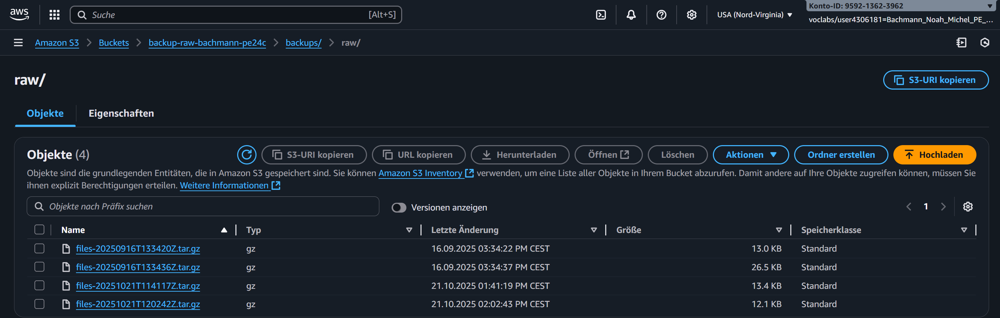

# 03 – Backup-Konzept

Dieses Dokument beschreibt das Backup-Konzept für die Schul-Datenbank und die dazugehörige Infrastruktur.

---

## 🎯 Ziele des Backups
- Sicherung aller **kritischen Daten** (System, Konfiguration, Schülerdaten)
- Gewährleistung von **RTO ≤ 2h** und **RPO ≤ 24h**
- Rechtssichere Aufbewahrung nach **DSG/DSGVO**
- Automatisierung & Monitoring (Cronjobs, Logs, Mail)

---

## 🗂️ Backup-Umfang

1. **Systemdaten (EC2):**
   - Wöchentliche Erstellung von AMI-Snapshots
   - Enthält OS, Konfiguration und installierte Software

2. **Konfigurationsdaten:**
   - `/etc` + weitere kritische Verzeichnisse
   - Tägliches inkrementelles Backup, wöchentlich Vollbackup

3. **Anwendungsdaten:**
   - Dateien und Logs der Schulsoftware
   - Speicherung in S3

4. **Datenbank (RDS MySQL – school):**
   - Tägliche Dumps (`mysqldump` → S3)
   - Tägliche RDS-Snapshots

---

## 📦 Speicherorte

- **S3 Standard**  
  - Speicherung für 30 Tage
- **S3 Glacier**  
  - Archivierung bis 90 Tage
- **Automatische Löschung nach 90 Tagen**  
  - Umsetzung Datensparsamkeit nach DSGVO

---

## 🔐 Sicherheit

- S3 Buckets mit **SSE-S3 Verschlüsselung**
- **Public Access Block** aktiv
- Zugriff nur via IAM-Rollen & EC2
- Datenbank **nicht öffentlich zugänglich**

---

## 📅 Backup-Zeitplan

| Backup-Typ         | Häufigkeit   | Uhrzeit | Speicherort |
|--------------------|--------------|---------|-------------|
| Datei-Backup       | täglich      | 02:00   | S3          |
| DB-Dump            | täglich      | 02:00   | S3          |
| RDS-Snapshot       | täglich      | 04:00   | RDS         |
| AMI (EC2)          | wöchentlich  | So 03:00| EC2 AMIs    |

---

## 📨 Monitoring & Reporting

- Logs werden in `/var/backups/logs/` gespeichert
- Mail-Benachrichtigung bei Fehlern oder Erfolg
- Test-Wiederherstellungen dokumentiert